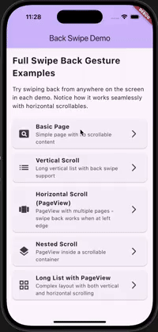
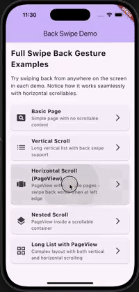
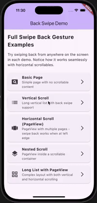
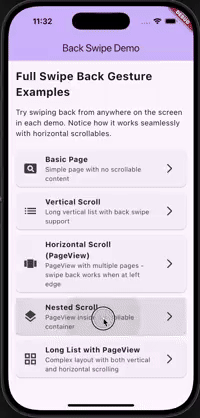

## full_swipe_back_gesture

**iOS-style full-screen back swipe gesture** `PageRoute` that solves the horizontal scroll conflict problem. Unlike standard Flutter navigation where horizontal scrollables (PageView, ListView) compete with and block back gestures, this package enables seamless back swiping from anywhere on the screen while preserving natural horizontal scroll behavior.

### Installation
```yaml
dependencies:
  full_swipe_back_gesture: ^0.1.0
```

### Usage
```dart
import 'package:full_swipe_back_gesture/full_swipe_back_gesture.dart';

Navigator.of(context).push(
  BackSwipePageRoute(
    builder: (_) => const DetailPage(),
  ),
);
```

#### Key Features
- **Full-screen swipe**: Back gesture works from anywhere on the screen, not just the edge
- **Smart conflict resolution**: Automatically detects when horizontal scrollables are at their left boundary
- **iOS-like behavior**: Edge swipes always trigger back gesture regardless of scrollable state
- **Customizable**: Adjust edge width, transition curves, and durations

#### Configuration Options
- **edgeStartWidthPx**: Width from left edge where back gesture always starts (default: 24.0px)
- **pushCurve / popCurve**: Animation curves for push/pop transitions
- **transitionDuration / reverseTransitionDuration**: Animation durations

### How It Works
- **Edge swipes**: Always trigger back gesture regardless of horizontal scrollable state
- **Non-edge swipes**: Only trigger back gesture when the topmost horizontal scrollable is at its left boundary
- **Gesture completion**: Uses velocity (>900px/s) or distance (>50% screen width) to determine pop action

### Examples
Check the `example/` app to see the package working with various layouts including PageView, nested scrollables, and long lists.

## 🎬 Live Demo

The following GIFs demonstrate the package in action across different scenarios:

### 📱 Preview

| Scenario | Description | Demo |
|----------|-------------|------|
| **Normal Swipe** | Basic back swipe gesture from anywhere on screen |  |
| **PageView Swipe** | Back swipe works even with horizontal PageView at left edge |  |
| **Edge Swipe** | Edge swipes always trigger back gesture regardless of scrollable state |  |
| **Nested Scroll** | Complex nested scrollable layouts with seamless back navigation |  |

### 🎯 Key Scenarios Explained

- **Normal Swipe**: Demonstrates the basic full-screen back swipe functionality
- **PageView Swipe**: Shows how the package resolves conflicts with horizontal scrollables
- **Edge Swipe**: Proves that edge swipes always work regardless of scrollable state
- **Nested Scroll**: Handles complex layouts with multiple scrollable widgets

### License
MIT